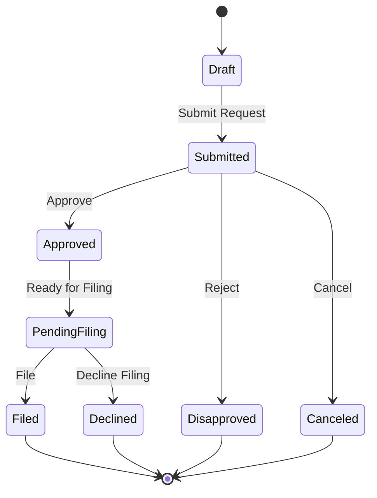
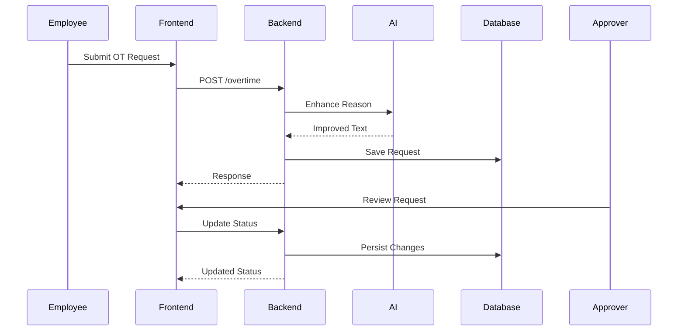

# TimeTrack Pro

An intelligent overtime tracking and management system designed
to improve transparency, accountability, and decision-making
across organizations.

---

## Overview

**TimeTrack Pro** digitizes the entire overtime lifecycle -- from
request filing to final approval and filing -- while enhancing visibility
into *why* overtime happens.

Instead of treating overtime as just numbers, the system captures and
improves the **reasoning behind each request** using AI. This enables
approvers and management to make better, data-driven decisions.

### Goals

- Eliminate manual overtime tracking
- Improve justification and auditability of overtime requests
- Provide actionable insights through analytics and AI
- Standardize approval workflows across teams

---

## Key Features

### Overtime Filing

- Employees submit overtime requests with reasons
- AI enhances and standardizes descriptions for clarity
- Built-in validation against schedules and limits

### Approval Workflow

- Multi-stage approval process
- Clear status transitions (Pending -> Approved -> Filed, etc.)
- Full audit trail of actions and decisions

### Schedule Management

- Weekly shift configuration per employee
- Custom shift codes and flexible scheduling

### Policy Enforcement

- Configurable overtime limits per department or unit
- Prevents excessive or invalid filings

### Analytics and Insights

- Visual dashboards powered by charts
- AI-generated summaries and reports
- Identify trends and root causes of overtime

---

## System Flow

The following diagrams show how an overtime request evolves
through the system.

### State Diagram

- **Draft** - Initial state before submission
- **Submitted** - Waiting for approver action
- **Approved** - Approved but not yet finalized
- **Pending Filing** - Awaiting final filing step
- **Filed** - Completed and recorded
- **Terminal States** - Disapproved, Declined, Canceled

### Sequence Diagram

---

## Who Is This For?

### Developers

- Easily extendable Laravel + Vue architecture
- Clean separation of concerns
- Ready for API scaling and integrations

### Managers and Approvers

- Clear visibility of overtime reasons
- Data-driven approval decisions
- AI-assisted insights and summaries

### Employees

- Simple and guided overtime filing
- Transparent request tracking
- Faster approvals

---

## Tech Stack

- **Backend:** Laravel 11 (PHP 8.2+)
- **Frontend:** Vue 3 + Inertia.js
- **Styling:** TailwindCSS + DaisyUI
- **Database:** MySQL
- **Charts:** ECharts
- **AI Integration:** OpenAI API
- **Build:** Vite 7
- **Icons:** Iconify

---

## Documentation

| Document                              | Description                                         |
| ------------------------------------- | --------------------------------------------------- |
| [Installation](docs/INSTALLATION.md)   | Clone repo, install PHP and Node dependencies       |
| [Setup](docs/SETUP.md)                | Environment config, database, seeding, and running  |
| [Database](docs/DATABASE.md)          | Full schema with column details and ERD              |
| [Routes](docs/ROUTES.md)              | All web routes organized by role and middleware group |
