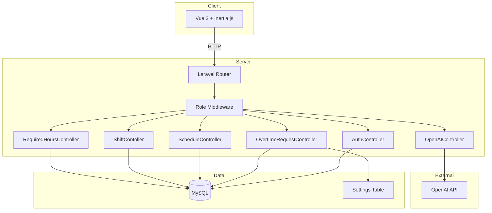
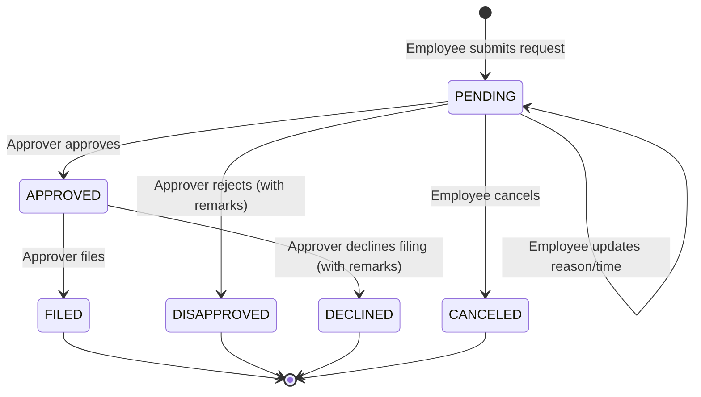
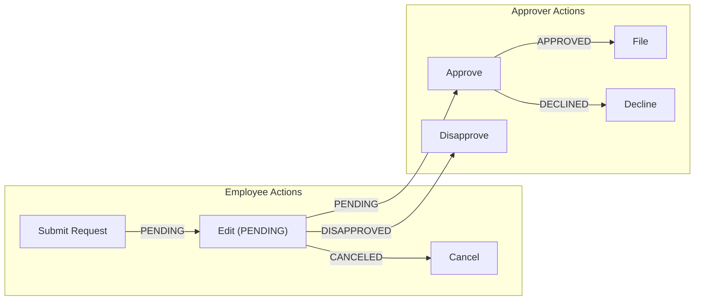
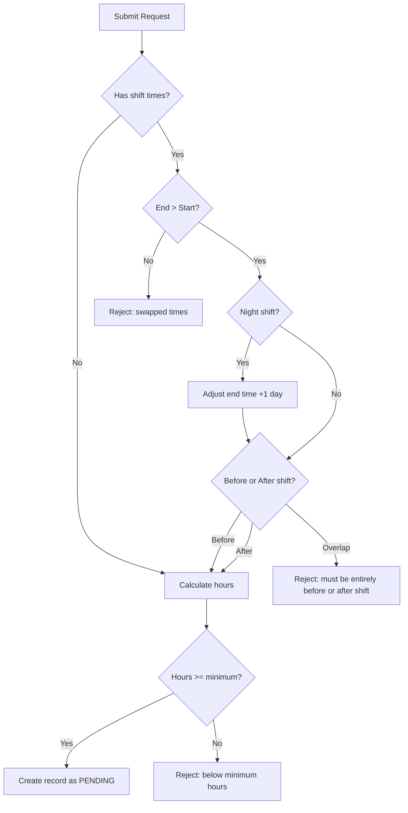
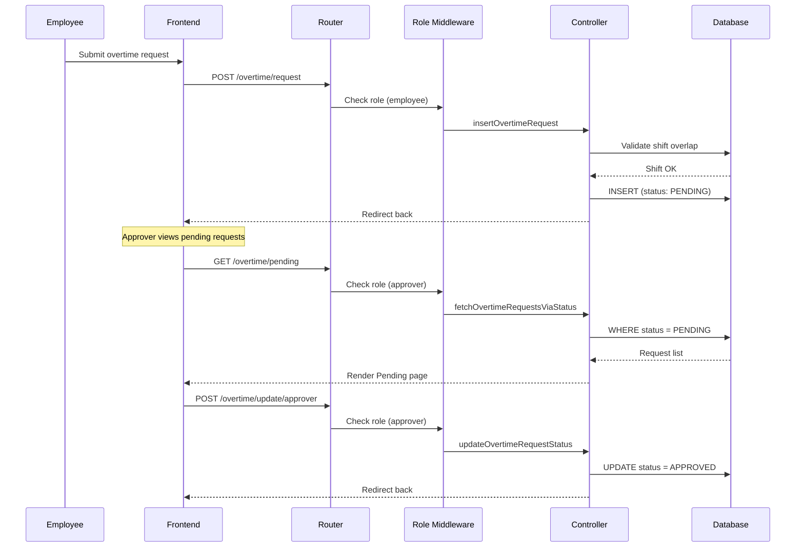
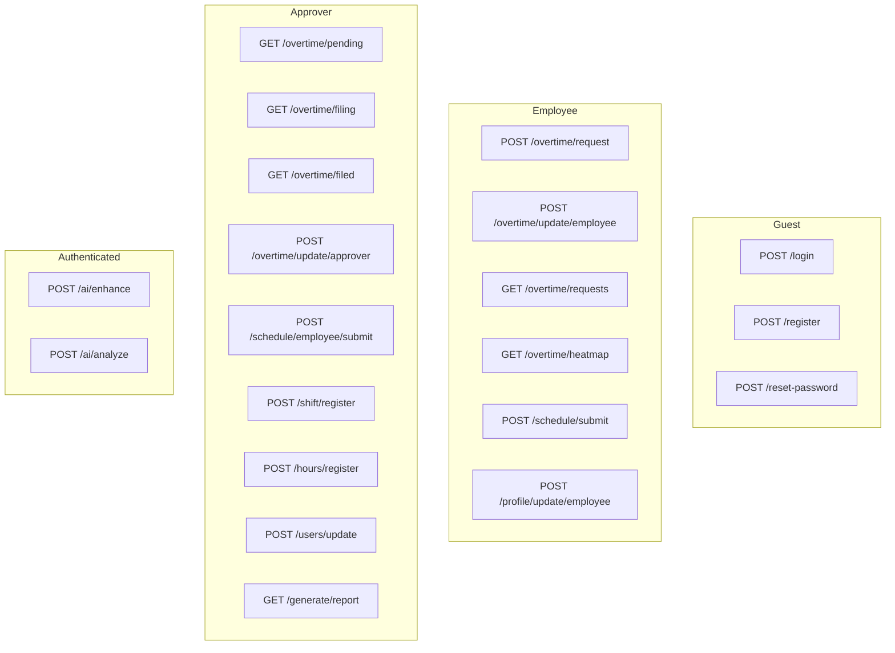
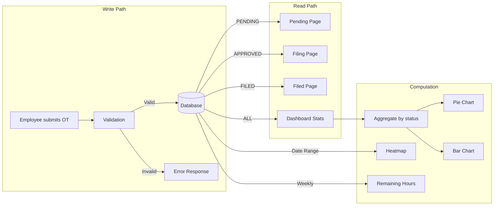
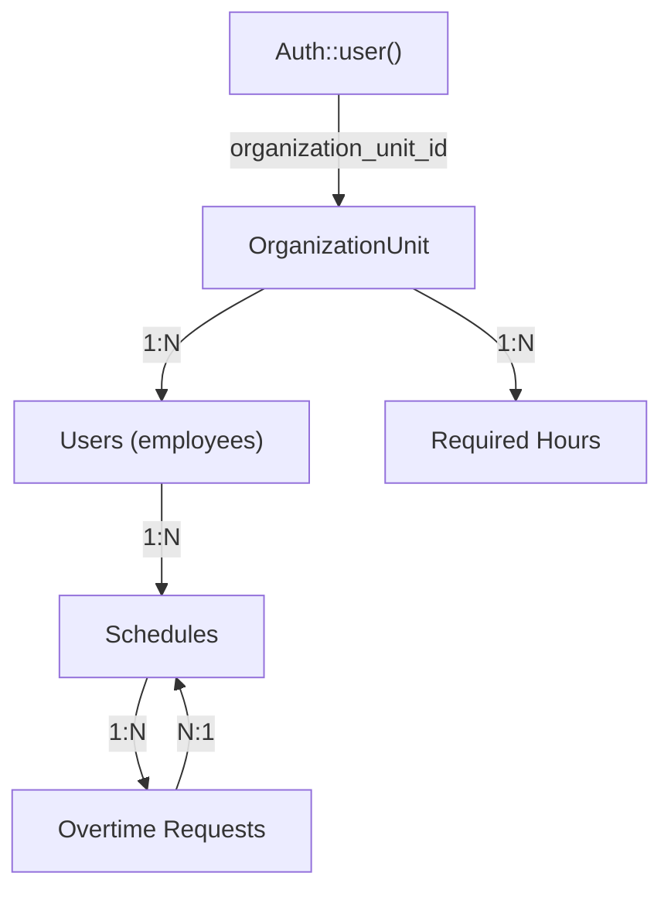
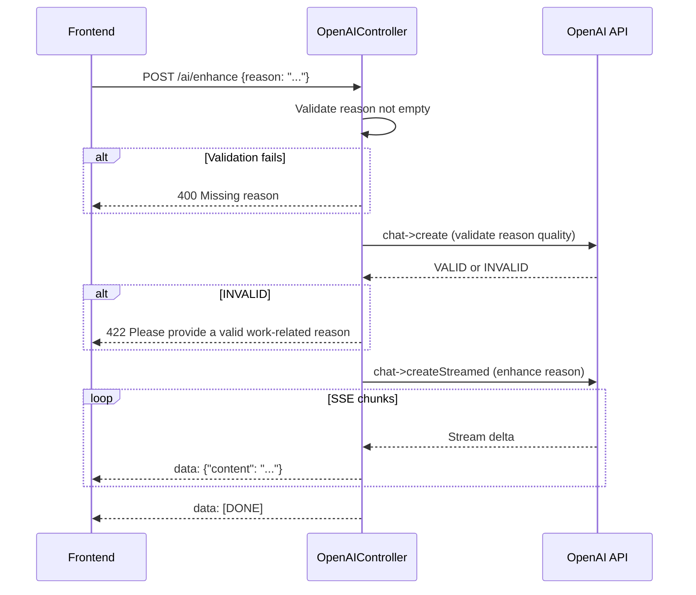

# Architecture

## System Overview

---

## Overtime Approval Workflow

The core of TimeTrack Pro is the overtime request lifecycle. Every request follows a strict state machine with defined transitions and validation rules.

### State Diagram

### State Descriptions

| State | Actor | Description |
|-------|-------|-------------|
| `PENDING` | Employee | Initial state after submission. Can update reason or times while pending. |
| `APPROVED` | Approver | Request validated and approved. Awaiting final filing. |
| `FILED` | Approver | Finalized and recorded. Terminal state. |
| `DISAPPROVED` | Approver | Rejected during review. Requires remarks explaining why. Terminal state. |
| `DECLINED` | Approver | Rejected during filing stage. Requires remarks explaining why. Terminal state. |
| `CANCELED` | Employee | Withdrawn by the employee. Terminal state. |

---

### Valid Transitions

### Transition Rules

| From | To | Actor | Validation |
|------|----|-------|------------|
| `(new)` | `PENDING` | Employee | Shift overlap check, minimum hours, time boundary validation |
| `PENDING` | `PENDING` | Employee | Same as new submission (re-validates times and reason) |
| `PENDING` | `APPROVED` | Approver | Current status must be `PENDING` |
| `PENDING` | `DISAPPROVED` | Approver | Requires `remarks` (min 10 chars) |
| `PENDING` | `CANCELED` | Employee | Current status must be `PENDING` |
| `APPROVED` | `FILED` | Approver | Current status must be `APPROVED` |
| `APPROVED` | `DECLINED` | Approver | Requires `remarks` (min 10 chars) |

---

## Request Processing Flow

### Submission Validation

When an employee submits or updates a pending request, the system validates:

### Approval Flow

---

## Role-Based Access

| Role | Middleware | Access |
|------|-----------|--------|
| Guest | `guest` | Login, register, password reset |
| Employee | `employee` | Own overtime CRUD, own schedule, profile, heatmap |
| Approver | `approver` | All employee access + approve/file/decline requests, manage shifts/hours/users/schedules, reports |
| Admin | `admin-approver` | Full approver access + system settings management |
| Any Auth | `auth` | AI enhance/analyze |

---

## Data Flow

### How Data Reaches the Dashboard

### Organization Unit Scoping

All data is scoped to the authenticated user's `organization_unit_id`:

Employees can only see their own data. Approvers see all employees within their organization unit.

---

## AI Integration

---

Back: [README](../README.md)
