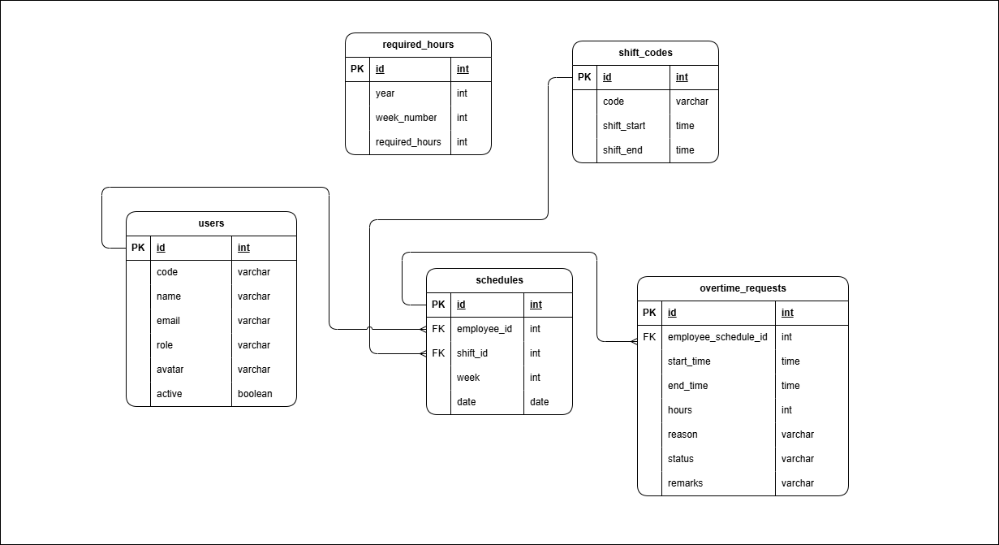

# Database Schema

## Entity Relationship Diagram



---

## Tables

### `users`

Stores all user accounts (employees, approvers, and admins).

| Column               | Type         | Constraints                          |
| -------------------- | ------------ | ------------------------------------ |
| `id`                 | bigint       | Primary key, auto-increment          |
| `name`               | varchar(255) | Not nullable                         |
| `employeeid`         | varchar(255) | Unique, not nullable                 |
| `role`               | varchar(255) | Not nullable                         |
| `email`              | varchar(255) | Unique, not nullable                 |
| `email_verified_at`  | timestamp    | Nullable                             |
| `password`           | varchar(255) | Not nullable                         |
| `avatar`             | varchar(255) | Nullable                             |
| `active`             | boolean      | Default: `true`                      |
| `organization_unit_id` | bigint    | Nullable, FK -> `organization_units.id` |
| `remember_token`     | varchar(100) | Nullable                             |
| `created_at`         | timestamp    |                                      |
| `updated_at`         | timestamp    |                                      |

- `id` - Unique user identifier
- `name` - Full name of the user
- `employeeid` - Employee ID number
- `role` - User role: `employee`, `approver`, or `admin`
- `email` - Email address used for login
- `email_verified_at` - Timestamp when email was verified
- `password` - Bcrypt-hashed password
- `avatar` - Path to user's profile avatar image
- `active` - Whether the user account is active
- `organization_unit_id` - Org unit the user belongs to (cascade
  on update, null on delete)
- `remember_token` - Token for "remember me" sessions

---

### `organization_units`

Stores organizational units/departments that users and required
hours belong to.

| Column        | Type        | Constraints              |
| ------------- | ----------- | ------------------------ |
| `id`          | bigint      | Primary key, auto-increment |
| `unit_path`   | varchar(50) | Not nullable             |
| `created_at`  | timestamp   |                          |
| `updated_at`  | timestamp   |                          |

- `id` - Unique unit identifier
- `unit_path` - Name or path of the organization unit (e.g. "Default")

---

### `shift_codes`

Stores registered shift codes with optional time windows. Used in
schedule management.

| Column       | Type        | Constraints              |
| ------------ | ----------- | ------------------------ |
| `id`         | bigint      | Primary key, auto-increment |
| `code`       | varchar(20) | Not nullable             |
| `start_time` | time        | Nullable                 |
| `end_time`   | time        | Nullable                 |
| `created_at` | timestamp   |                          |
| `updated_at` | timestamp   |                          |

- `id` - Unique shift identifier
- `code` - Shift code label (e.g. "AA", "BB", "SY")
- `start_time` - Shift start time in HH:MM format. Null means no
  time window (rest day/holiday)
- `end_time` - Shift end time in HH:MM format. Null means no
  time window (rest day/holiday)

---

### `schedules`

Stores weekly shift assignments for each employee. One row per
employee per day.

| Column     | Type       | Constraints              |
| ---------- | ---------- | ------------------------ |
| `id`       | bigint     | Primary key, auto-increment |
| `user_id`  | bigint     | Not nullable, FK -> `users.id` |
| `shift_id` | bigint     | Not nullable, FK -> `shift_codes.id` |
| `week`     | tinyint    | Not nullable             |
| `date`     | date       | Not nullable             |
| `created_at` | timestamp |                          |
| `updated_at` | timestamp |                          |

- `id` - Unique schedule entry identifier
- `user_id` - The employee this schedule belongs to (restrict on
  delete)
- `shift_id` - The shift code assigned for this day (restrict on
  delete)
- `week` - Week number of the year (Sunday-based calculation)
- `date` - The specific calendar date for this schedule entry

---

### `overtime_requests`

Stores overtime filings submitted by employees and tracked through
the approval workflow.

| Column                | Type       | Constraints              |
| --------------------- | ---------- | ------------------------ |
| `id`                  | bigint     | Primary key, auto-increment |
| `employee_schedule_id` | bigint   | Not nullable, FK -> `schedules.id` |
| `start_time`          | time       | Not nullable             |
| `end_time`            | time       | Not nullable             |
| `hours`               | float      | Default: `0`             |
| `reason`              | mediumtext | Nullable                 |
| `status`              | text       | Default: `'PENDING'`     |
| `remarks`             | text       | Nullable                 |
| `created_at`          | timestamp  |                          |
| `updated_at`          | timestamp  |                          |

- `id` - Unique request identifier
- `employee_schedule_id` - The schedule entry this overtime is
  filed against (restrict on delete)
- `start_time` - Overtime start time in HH:MM format (24-hour)
- `end_time` - Overtime end time in HH:MM format (24-hour)
- `hours` - Computed overtime hours (start to end)
- `reason` - Reason for overtime filing. Supports long text
- `status` - Current status: `PENDING`, `APPROVED`, `FILED`,
  `DISAPPROVED`, `CANCELED`, `DECLINED`
- `remarks` - Optional remarks added by approver

**Status Lifecycle:**

```text
PENDING -> APPROVED -> FILED (final)
PENDING -> DISAPPROVED (terminal)
PENDING -> CANCELED (terminal, by employee)
APPROVED -> DECLINED (terminal, by approver)
```

---

### `required_hours`

Stores the weekly overtime limit per organization unit and week.

| Column                | Type    | Constraints              |
| --------------------- | ------- | ------------------------ |
| `id`                  | bigint  | Primary key, auto-increment |
| `year`                | integer | Not nullable             |
| `week`                | tinyint | Not nullable             |
| `organization_unit_id` | bigint | Nullable, FK -> `organization_units.id` |
| `required_hours`      | integer | Default: `0`             |
| `created_at`          | timestamp |                        |
| `updated_at`          | timestamp |                        |

- `id` - Unique record identifier
- `year` - The year this requirement applies to
- `week` - The week number this requirement applies to
- `organization_unit_id` - The org unit this requirement belongs
  to (cascade on delete)
- `required_hours` - Number of required overtime hours for the week

---

### `sessions`

Laravel default session storage (database driver).

| Column         | Type      | Constraints              |
| -------------- | --------- | ------------------------ |
| `id`           | varchar(128) | Primary key            |
| `user_id`      | bigint    | Nullable, indexed        |
| `ip_address`   | varchar(45) | Nullable               |
| `user_agent`   | text      | Nullable                 |
| `payload`      | longtext  | Not nullable             |
| `last_activity` | integer  | Indexed                  |

- `id` - Unique session identifier
- `user_id` - The user who owns this session
- `ip_address` - Client IP address
- `user_agent` - Client user agent string
- `payload` - Serialized session data
- `last_activity` - Unix timestamp of last activity

---

## Relationships

```text
organization_units 1──N users
organization_units 1──N required_hours
users          1──N schedules
shift_codes    1──N schedules
schedules      1──N overtime_requests
```
